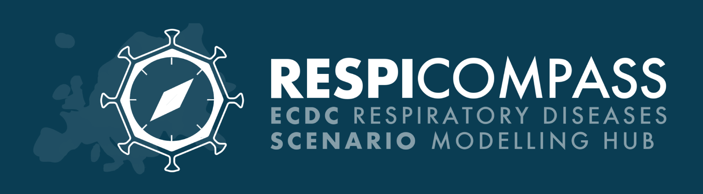

# ❗️ RespiCompass Latest Scenario Round: [RSV 2025/26](https://github.com/european-modelling-hubs/RespiCompass/blob/main/round1_2526_rsv.md)
For information regarding the call for the latest RespiCompass scenario round on RSV see the [dedicated Readme file](https://github.com/european-modelling-hubs/RespiCompass/blob/main/round1_2526_rsv.md). 

Deadline for submissions is 2025/12/01.

Teams interested in participating in the upcoming RSV scenario round are encouraged to get in touch at [rsv-respicompass@isi.it](mailto:rsv-respicompass@isi.it).

## RespiCompass Background 
RespiCompass is ECDC’s hub dedicated to scenario modelling of viral respiratory diseases. Scenario modelling explores mid- to long-term projections that incorporate specific scenario assumptions to manage uncertainty. The scenarios are designed to support policymakers by providing insights into the potential impact of public health interventions and different epidemiological contexts. RespiCompass brings together multiple modelling groups working collaboratively with experts in respiratory virus surveillance, as well as other ECDC stakeholders, including public health agencies at both national and supranational levels.

## How to Join RespiCompass
RespiCompass welcomes modelling teams willing to contribute their projections. 

To join the project, teams shall pre-register by sending an email to European.Modelling.Hub@ecdc.europa.eu, describing the projections model they are going to use. 
Registration is not binding, teams are encouraged to register even if they are unsure if they'll be able to participate. **Please register as soon as possible if you're interested!**

Detailed information on how to join are provided in the [Wiki](https://github.com/european-modelling-hubs/RespiCompass/wiki). Here’s a concise guide on how to participate:

1. **Create a metadata file**:
   - Include key information about your team and model.
   - read more [detailed instructions to create a metadata file](https://github.com/european-modelling-hubs/RespiCompass/wiki/Metadata).

2. **Develop your model and model projections**:
   - Develop your model and produce projections. We value diverse model approaches and implementations.
   - Ensure your projections respect the provided scenario assumptions (refer to specific rounds information).

3. **Submit model projections**:
   - Follow the [submission format guidelines](https://github.com/european-modelling-hubs/RespiCompass/wiki/Submission-format).
   - Submit your projections by following the [instructions to open a pull request on GitHub](https://github.com/european-modelling-hubs/RespiCompass/wiki/Submitting-using-GitHub-Website).

For any questions, please email us at [European.Modelling.Hub@ecdc.europa.eu](mailto:European.Modelling.Hub@ecdc.europa.eu). You are also welcome to join our slack channel, please send us an email and we will invite you.
